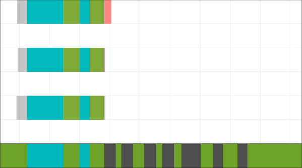
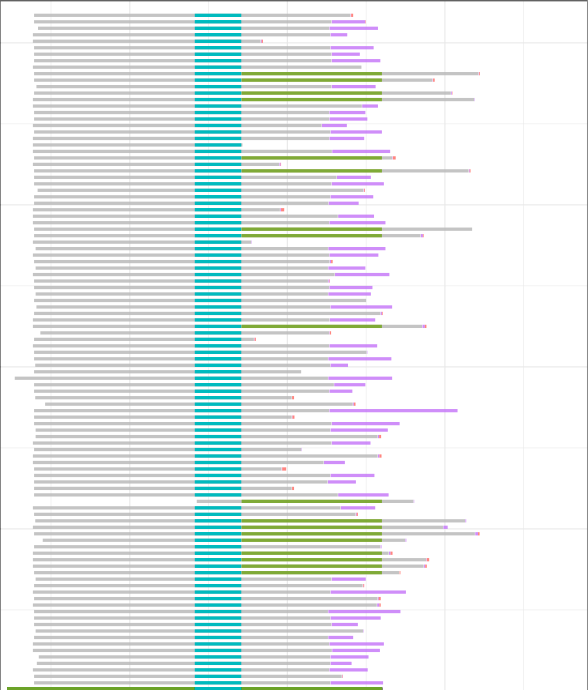

<link href="style.css" rel="stylesheet"></link>

# Intronic Intronic Profile plot

The FLEPseq2 pipeline detects the introns that have not been spliced. I use this information as well as the transcripts' coordinates to reprsent each reads, the polyA tail and the additional tail, if any. 

The introns_retained column can be easily misunderstood as there are some transcripts that do not cover the whole annotation, this doesn't mean that the introns that are not present are correctly spliced, just that the transcripts' bounds are different.
To illustrate this, here is an example:

Please note as well that if an exon is incomplete (it doesn't cover the annotation totally), the color of this exon will be erroneous. This can happen very often if the annotation is imprecise, specifically if the 5' end is incorrect. 
Here is an example of wrongly represented exons due to a wrong annotation:

